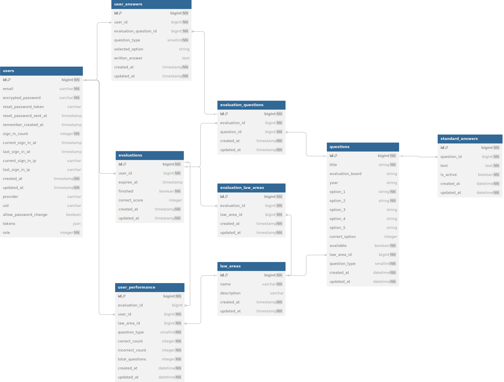

# 📘 Documento de Modelagem de Dados (DMD)

## 🧾 Informações Gerais

- **Projeto**: Sistema de Simulados OAB
- **Autor**: Ana Karina Caetano e Sarah Bethelim
- **Data de Criação**: 12/03/2025
- **Última Atualização**: 25/05/2025
- **Ferramenta utilizada:**: [dbdiagram.io (DBML)](https://dbml.dbdiagram.io/home)
- **Tecnologias utilizadas**: Ruby on Rails 7.1.2 + PostgreSQL

---

## 🧠 Visão Geral

O sistema de simulados tem como objetivo oferecer questões da OAB para treinamento dos alunos, com suporte para questões objetivas e discursivas. O banco de dados armazena informações sobre os simulados, usuários, questões, respostas e estatísticas dos usuários.

---

## 🔶 Diagrama Entidade-Relacionamento (ER)

---

## 🗂️ Dicionário de Dados

### 📌 Entidade: `User`

Representa os usuários da plataforma, com dados de autenticação, controle de acesso e informações para gerenciamento de sessão.

| Campo                 | Tipo      | Chave | Not Null | Descrição                                                          |
|-----------------------|-----------|-------|----------|--------------------------------------------------------------------|
| id                    | bigint    | PK    | ✔        | Identificador único                                                |
| email                 | string    |       | ✔        | E-mail do usuário                                                  |
| encrypted_password    | string    |       | ✔        | Senha criptografada                                                |
| reset_password_token  | string    |       |          | Token para redefinição de senha                                    |
| reset_password_sent_at| datetime  |       |          | Data do envio do token                                             |
| remember_created_at   | datetime  |       |          | Data de criação do cookie de sessão                                |
| sign_in_count         | integer   |       | ✔        | Contagem de acessos                                                |
| current_sign_in_at    | datetime  |       |          | Data do último acesso atual                                        |
| last_sign_in_at       | datetime  |       |          | Data do penúltimo acesso                                           |
| current_sign_in_ip    | string    |       |          | IP do último acesso atual                                          |
| last_sign_in_ip       | string    |       |          | IP do penúltimo acesso                                             |
| created_at            | datetime  |       | ✔        | Data de criação                                                   |
| updated_at            | datetime  |       | ✔        | Data de atualização                                               |
| provider              | string    |       |          | Provedor de autenticação                                          |
| uid                   | string    |       |          | UID do provedor                                                  |
| allow_password_change | boolean   |       |          | Permite redefinir senha sem token                                 |
| tokens                | json      |       |          | Tokens de autenticação                                           |
| role                  | integer   |       | ✔        | Perfil do usuário: 0 = basic, 1 = premium, 2 = admin             |

#### 🔗 Relacionamentos

- Um `User` pode ter várias `Evaluations` realizadas.
- Um `User` pode ter várias `UserAnswers` (respostas dadas).

### 📌 Entidade: `LawArea`

Representa uma área do Direito (como Direito Penal, Civil, Constitucional, etc.).
| Campo       | Tipo      | Chave | Not Null | Descrição                   |
|-------------|-----------|-------|----------|-----------------------------|
| id          | bigint    | PK    | ✔        | Identificador único         |
| name        | string    |       | ✔        | Nome da área                |
| description | string    |       |          | Descrição da área           |
| created_at  | datetime  |       | ✔        | Data de criação             |
| updated_at  | datetime  |       | ✔        | Data de atualização         |

#### 🔗 Relacionamentos

- Uma `LawArea` pode ter várias `questions` associadas.
- Uma `LawArea` pode estar associada a várias `Evaluations` via `EvaluationLawArea`.
- Uma `LawArea` pode estar associada a vários `UserPerformances`.

### 📌 Entidade: `Question`

Representa uma questão do simulado, com opções de respostas, correta, área do direito relacionada e informações da prova.

| Campo            | Tipo      | Chave | Not Null | Descrição                      |
|------------------|-----------|-------|----------|-------------------------------|
| id               | bigint    | PK    | ✔        | Identificador único            |
| title            | string    |       | ✔        | Título da questão             |
| evaluation_board | string    |       |          | Banca avaliadora              |
| year             | string    |       |          | Ano da questão               |
| option_1         | string    |       | ✔        | Opção de resposta 1          |
| option_2         | string    |       | ✔        | Opção de resposta 2          |
| option_3         | string    |       | ✔        | Opção de resposta 3          |
| option_4         | string    |       | ✔        | Opção de resposta 4          |
| option_5         | string    |       |          | Opção de resposta 5 (opcional)|
| correct_option   | integer   |       | ✔        |Índice da resposta correta (1 a 5) — apenas para questões objetivas   #type == 1          |
| available        | boolean   |       |        | Indica se a questão está disponível|
| law_area_id      | bigint    | FK    | ✔        | Referência à Área de direito|
| created_at       | datetime  |       | ✔        | Data de criação              |
| updated_at       | datetime  |       | ✔        | Data de atualização          |
| question_type    | smallint  |       | ✔        | Tipo da questão (enum: 1=objetiva, 2=discursiva, 3=dissertativa)       |

#### 🔗 Relacionamentos

- Uma `Question` pertence a uma `LawArea`.
- Uma `Question` pertence a um `questiton_type` (tipo da questão, via campo `questiton_type`).
- Uma `Question` tem uma `StandardAnswer` (somente se discursiva ou dissertativa)
- Uma `Question` pode ter várias `UserAnswers` (respostas dadas pelos usuários).
- Uma `Question` pode estar em várias `Evaluations` via EvaluationQuestion.
- Uma `Question` pode ter muitas `UserAnswers`, cada uma associada a um usuário diferente e avaliação diferente.

### 📌 Entidade: `Evaluation`

Representa uma tentativa de simulado feita por um usuário. Cada `Evaluation` pertence a um usuário e armazena a pontuação e status do simulado.

| Campo       | Tipo      | Chave | Not Null | Descrição                             |
|-------------|-----------|-------|----------|---------------------------------------|
| id          | bigint    | PK    | ✔        | Identificador único                   |
| expires_at  | datetime  |       |          | Data de expiração do simulado         |
| finished    | boolean   |       | ✔        | Indica se o simulado foi finalizado   |
| user_id     | bigint    | FK    | ✔        | Referência ao usuário                 |
| correct_score | integer   |       |        | Pontuação final obtida                |
| created_at  | datetime  |       | ✔        | Data de criação                       |
| updated_at  | datetime  |       | ✔        | Data de atualização                   |

#### 🔗 Relacionamentos

- Uma `Evaluation` pertence a um `User`.
- Uma `Evaluation` pode ter várias `Questions` (questões que compõem o simulado).
- Uma `Evaluation` pode ter várias `UserAnswers` (questões respondidas).
- Uma `Evaluation` pode estar associada a várias `LawAreas` via `EvaluationLawArea`.

### 📌 Entidade: `EvaluationLawArea`

Associação entre simulados (`Evaluation`) e áreas do direito (`LawArea`). Usada para organizar e filtrar questões conforme a área jurídica.

| Campo         | Tipo     | Chave | Not Null | Descrição                            |
|---------------|----------|-------|----------|----------------------------------------|
| id            | bigint   | PK    | ✔        | Identificador único                    |
| evaluation_id | bigint   | FK    | ✔        | Referência ao simulado                 |
| law_area_id   | bigint   | FK    | ✔        | Referência à área do direito           |
| created_at    | datetime |       | ✔        | Data de criação                        |
| updated_at    | datetime |       | ✔        | Data de atualização                    |

#### 🔗 Relacionamentos

- Uma `EvaluationLawArea` pertence a uma `Evaluation`.
- Uma `EvaluationLawArea` pertence a uma `LawArea`.

### 📌 Entidade: `EvaluationQuestion`

Associa uma questão (`Question`) a um simulado (`Evaluation`). É uma tabela intermediária para compor os simulados com diferentes questões.

| Campo         | Tipo     | Chave | Not Null | Descrição               |
|---------------|----------|-------|----------|-------------------------|
| id            | bigint   | PK    | ✔        | Identificador único     |
| evaluation_id | bigint   | FK    | ✔        | Referência ao simulado  |
| question_id   | bigint   | FK    | ✔        | Referência à questão    |
| created_at    | datetime |       | ✔        | Data de criação         |
| updated_at    | datetime |       | ✔        | Data de atualização     |

#### 🔗 Relacionamentos

- Uma `EvaluationQuestion` pertence a uma `Evaluation`.
- Uma `EvaluationQuestion` pertence a uma `Question`.
- Uma `EvaluationQuestion` pode ter várias `UserAnswers`.

### 📌 Entidade: `UserAnswer`

Armazena as respostas fornecidas pelos usuários em cada simulado, podendo incluir alternativas selecionadas ou respostas escritas, dependendo do tipo de questão.

| Campo                  | Tipo      | Chave | Not Null | Descrição                                                        |
|------------------------|-----------|-------|----------|------------------------------------------------------------------|
| id                     | bigint    | PK    | ✔        | Identificador único                                              |
| evaluation_question_id | bigint    | FK    | ✔        | Referência à questão dentro do simulado                         |
| user_id                | bigint    |  FK     | ✔        | Referência ao usuário que respondeu                     |
| question_type                   | smallint  |       | ✔        | Tipo da questão (1=obj., 2=disc., 3=dissert.)                   |
| selected_option        | string    |       |          | Alternativa escolhida (para questões objetivas)                 |
| written_answer         | text      |       |          | Resposta escrita pelo usuário (para discursivas/dissertativas)  |
| created_at             | datetime  |       | ✔        | Data de criação                                                  |
| updated_at             | datetime  |       | ✔        | Data de atualização                                              |

#### 🔗 Relacionamentos

- Uma `UserAnswer` pertence a uma `User`.
- Uma `UserAnswer` pertence a uma `EvaluationQuestion`.
- Uma `UserAnswer` é associada a um `tipo` de questão (definido por enum).
- Uma `UserAnswer` pode estar associada a uma `StandardAnswer` (quando discursiva/dissertativa).

### 📌 Entidade: `StandardAnswer`

Armazena as respostas padrão (gabarito textual) associadas a uma questão. Útil para correção de questões discursivas/dissertativas.

| Campo       | Tipo     | Chave | Not Null | Descrição                                                  |
|-------------|----------|-------|----------|------------------------------------------------------------|
| id          | bigint   | PK    | ✔        | Identificador único                                        |
| question_id | bigint   | FK    | ✔        | Referência à questão da tabela `questions`                 |
| text        | text     |       | ✔        | Conteúdo da resposta padrão                                |
| is_active   | boolean  |       | ✔        | Indica se a resposta está ativa (para versionamento)  |
| created_at  | datetime |       | ✔        | Data de criação                                            |
| updated_at  | datetime |       | ✔        | Data de atualização                                        |

#### 🔗 Relacionamentos

- Uma `StandardAnswer` pertence a uma `Question`.
- Uma `StandardAnswer` pode estar relacionada a várias `UserAnswers`.

### 📌 Entidade: `UserPerformance`

Registra estatísticas consolidadas de desempenho de um aluno, por área do direito, tipo de questão e simulado.

#### 📋 Dicionário de Dados

| Campo            | Tipo       | Chave | Not Null | Descrição                                                        |
|------------------|------------|-------|----------|------------------------------------------------------------------|
| id               | bigint     | PK    | ✔        | Identificador único                                              |
| user_id          | bigint     | FK    | ✔        | Referência ao usuário                                            |
| law_area_id      | bigint     | FK    | ✔        | Referência à área do direito                                     |
| question_type    | smallint   |       | ✔        | Tipo da questão (1 = objetiva, 2 = discursiva, 3 = dissertativa) |
| evaluation_id    | bigint     | FK    |          | Simulado relacionado (pode ser NULL para visão consolidada)      |
| correct_count    | integer    |       | ✔        | Total de questões respondidas corretamente                       |
| incorrect_count  | integer    |       | ✔        | Total de questões respondidas incorretamente                     |
| total_questions  | integer    |       | ✔        | Total de questões respondidas                                    |
| created_at       | datetime   |       | ✔        | Data de criação                                                  |
| updated_at       | datetime   |       | ✔        | Data de atualização                                              |

#### 🔗 Relacionamentos

- Um `UserPerformance` pertence a um `User`.  
- Um `UserPerformance` pertence a uma `LawArea`.  
- Um `UserPerformance` pode estar relacionado a um `Evaluation` (simulado).
---

## ⚖️ Regras de Negócio

- Cada questão pode ter uma ou mais respostas padrão.
- Questões objetivas devem ter uma alternativa correta indicada.
- Questões discursivas devem ser comparadas com uma ou mais respostas padrão para feedback.

---
